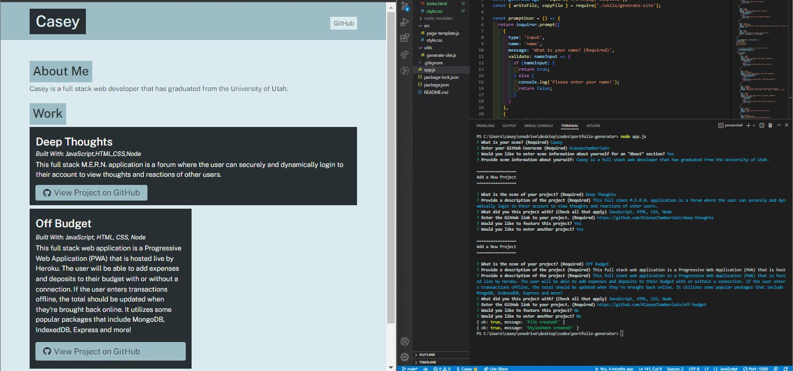

# Portfolio Generator

### Description
This application is run through the command-line utilizing the npm package inquirer to dynamically create an HTML web portfolio. Through the command-line, the user can centralize their previous web developer work as well as link out to the work's GitHub repository. This application also allows for a featured project.

### License

This application is licensed under MIT

### Application Demo

### Table of Contents
- [Description](#description)
- [Contributing](#contributing)
- [Tests](#tests)
- [Questions?](#questions)

### Contributing
No contributions at this time.

### Tests
N/A

### Questions
GitHub Username: (kcaseychamberlain) 

View the project in GitHub at: https://github.com/KCaseyChamberlain/portfolio-generator

Clone the repository to your local device and run the command "node app.js" from the root directory to run this application.

If you have any questions, contact Casey at: caseygchamberlain@gmail.com
